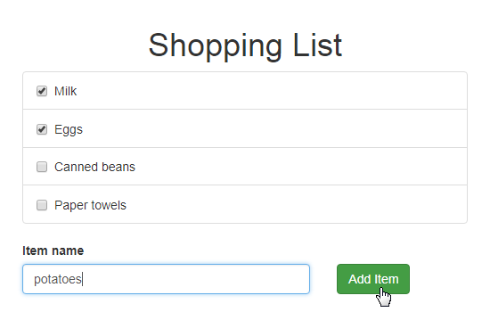

## **Lesson 5** - Frontend - Enable Data Editing

[\[Get the Code for This Lesson\]](https://github.com/reimagined/resolve/tree/master/examples/shopping-list-tutorial/lesson-5)

This lesson describes how to implement a visual interface required to edit shopping list items.

### Modify Backend Functionality

Apply the following modifications to the server code to allow a user to check and uncheck items:

1. Add a new event type that indicates that an item's checkbox was toggled.

**common/eventTypes.js:**

<!-- prettier-ignore-start -->

[embedmd]:# (../examples/shopping-list-tutorial/lesson-5/common/eventTypes.js /export const SHOPPING_ITEM_TOGGLED/ /\n$/)
```js
export const SHOPPING_ITEM_TOGGLED = "SHOPPING_ITEM_TOGGLED";
```

<!-- prettier-ignore-end -->

2. Add a command handler for the **toggleShoppingItem** command.

**common/aggregates/shopping_list.commands.js:**

<!-- prettier-ignore-start -->

[embedmd]:# (../examples/shopping-list-tutorial/lesson-5/common/aggregates/shopping_list.commands.js /^[[:blank:]]+toggleShoppingItem/   /^[[:blank:]]{2}\}/)
```js
  toggleShoppingItem: (state, { payload: { id } }) => {
    if (!state || !state.createdAt) {
      throw new Error(`shopping list does not exist`)
    }
    if (!id) throw new Error('id is required')
    return {
      type: SHOPPING_ITEM_TOGGLED,
      payload: { id }
    }
  }
```

<!-- prettier-ignore-end -->

The event payload contains the toggled item's ID.

4. Modify the **ShoppingList** View Model projection to take **SHOPPING_ITEM_TOGGLED** events into account.

**common/view-models/shopping_list.projection.js:**

<!-- prettier-ignore-start -->

[embedmd]:# (../examples/shopping-list-tutorial/lesson-5/common/view-models/shopping_list.projection.js /^[[:space:]]+\[SHOPPING_ITEM_TOGGLED\]/   /^[[:blank:]]+\}\)/)
```js
  [SHOPPING_ITEM_TOGGLED]: (state, { payload: { id } }) => ({
    ...state,
    list: state.list.map(item =>
      item.id === id
        ? {
            ...item,
            checked: !item.checked
          }
        : item
    )
  })
```

<!-- prettier-ignore-end -->

### Access Aggregate Commands on Frontend

A component connected to a reSolve View Model receives an array of aggregate actions (Redux actions that send commands to a reSolve aggregate). Use the following code to generate action creators for these actions.

**client/containers/ShoppingList.js:**

<!-- prettier-ignore-start -->

[embedmd]:# (../examples/shopping-list-tutorial/lesson-5/client/containers/ShoppingList.js /export const mapDispatchToProps/   /\n$/)
```js
export const mapDispatchToProps = (dispatch, { aggregateActions }) =>
  bindActionCreators(
    {
      ...aggregateActions
    },
    dispatch
  )

export default connectViewModel(mapStateToOptions)(
  connect(
    null,
    mapDispatchToProps
  )(ShoppingList)
)
```

<!-- prettier-ignore-end -->

In this code, the component is first connected to a **Redux** state using the **connect** HOC from the **react-redux** library. Next, the component is connected to a reSolve View Model. The **mapDispatchToProps** function takes the reSolve aggregate actions from the component's payload and wraps every action into a **dispatch** call.

### Implement Data Editing UI

#### Item Creation

Use the **createShoppingItem** action creator to add new shopping list items. The UI markup is shown below:

**common/view-models/shopping_list.projection.js:**

<!-- prettier-ignore-start -->

[embedmd]:# (../examples/shopping-list-tutorial/lesson-5/client/containers/ShoppingList.js /^[[:space:]]+\<ControlLabel\>Item name/   /\<\/Row\>/)
```js
        <ControlLabel>Item name</ControlLabel>
        <Row>
          <Col md={8}>
            <FormControl
              className="example-form-control"
              type="text"
              value={this.state.itemText}
              onChange={this.updateItemText}
              onKeyPress={this.onItemTextPressEnter}
            />
          </Col>
          <Col md={4}>
            <Button
              className="example-button"
              bsStyle="success"
              onClick={this.createShoppingItem}
            >
              Add Item
            </Button>
          </Col>
        </Row>
```

<!-- prettier-ignore-end -->

This markup uses the following methods to handle UI interactions.

**common/view-models/shopping_list.projection.js:**

```js
createShoppingItem = () => {
  this.props.createShoppingItem('shopping-list-1', {
    text: this.state.itemText,
    id: Date.now().toString()
  })

  this.setState({
    itemText: ''
  })
}

updateItemText = event => {
  this.setState({
    itemText: event.target.value
  })
}

onItemTextPressEnter = event => {
  if (event.charCode === 13) {
    event.preventDefault()
    this.createShoppingItem()
  }
}
```

#### Item Selection

Use the **toggleShoppingItem** action creator to toggle a checkbox for a shopping list item.

**client/containers/ShoppingList.js:**

```js
render() {
  const toggleShoppingItem = this.props.toggleShoppingItem;
  ...
```

<!-- prettier-ignore-start -->

[embedmd]:# (../examples/shopping-list-tutorial/lesson-5/client/containers/ShoppingList.js /^[[:space:]]+\<Checkbox/   /\<\/Checkbox\>/)
```js
              <Checkbox
                inline
                checked={todo.checked}
                onChange={toggleShoppingItem.bind(null, 'shopping-list-1', {
                  id: todo.id
                })}
              >
                {todo.text}
              </Checkbox>
```

<!-- prettier-ignore-end -->

After the described steps, your application's UI should look as shown below.


